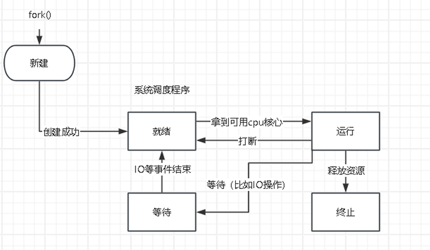

# 概念
## 进程
### 进程是什么？
* 进程是程序在内存中的一种表现形式，正在运行的叫进程，在磁盘里待着的叫程序
* 它是操作系统进行资源分配和调度的**基本单位**，不同进程之间是**相互独立**的
* 也就是说进程是一个运行中的程序
### 进程的组成
* 程序：描述进程要完成的功能，是控制进程执行的指令集
* 数据集合：程序执行时所需要的数据和工作区，即内存空间
	*  进程占用的内存空间通常不是一整块连续的空间，而是分散 的。在现代操作系统中，进程 的内存被组织为虚拟内存。虚拟内存 允许程序认为它拥有连续的内存空间，实际上这些空间可能被映射 到物理内存的不同部分，甚至是硬盘上的交换文件空间
* 进程控制块：包含进程的描述信息和控制信息，是进程存在的唯一标志
	1. 进程标识符（PID）：一个唯一的标识，用来区分系统中的不同 进程。linux 分配的进程的编号，每个进程都不一样方便管理。 进程在结束时，会释放PID 的所有权。其他进程等待它释放一段 时间后分配，但并不会结束后立马去分配出去
	2. 进程状态：指示进程当前的状态，如就绪、运行、等待、停止 等。
	3. 程序计数器（PC）：存储着该进程下一条要执行的指令的地址。
	4. CPU寄存器信息：包括累加器、索引寄存器、栈指针等在进程执 行过程中使用到的寄存器的当前值。
	5. CPU调度信息：如进程优先级、调度队列指针、进程的其他调度参数。
	6. 内存管理信息：如进程的地址空间、页表或者段表等内存管理 相关的信息。
	7. 会计信息：比如进程已使用的CPU时间量、实时时钟、时间限 制、账号信息等。 
	8. I/O状态信息：包括分配给进程的I/O设备列表和打开文件列表等
### 进程的状态
#### 常见状态：
1. 新建状态（New）：进程刚刚被创建，正在初始化，如分配PID、分配初 始内存等。 
2. 就绪状态（Ready）：进程已准备好运行并等待CPU分配时间。 
3. 运行状态（Running）：进程正在使用CPU执行指令。 
4. 等待/阻塞状态（Waiting/Blocked）：进程因为某种原因（例如等待I/O 操作、等待资源）无法执行，被放入阻塞队列。 
5. 终止状态（Terminated）：进程已完成执行或因错误退出，释放所占用 的资源。

这些状态的转换是由操作系统内核的调度程序（scheduler）和其他机制控 制和管理的。通过合理地管理进程状态，操作系统能够确保CPU资源得到高 效地利用，同时也使得多个进程能够并发执行
#### 状态的转换
* 就绪状态进入运行状态由系统内核里的调度程序决定
* 现在最常见的的调度算法是：多级反馈队列(Multilevel Feedback Queue, MFQ)
#### 额外的进程状态：
一些其他的操作系统（如Linux系统）还有额外的两个状态： 
2. 挂起就绪状态（Suspended Ready）：处于就绪状态的进程被挂起（换出内存），等待被重新激活到就绪状态。 
3. 挂起阻塞状态（Suspended Blocked）：处于阻塞状态的进程被挂起（换出内存），直到阻塞的原因消除，并且被重新激活到阻塞或就绪状态
### 进程的创建和父子进程
#### 1. 头文件
```c
#include <sys/types.h>
#include <unistd.h>
```
#### 2. 进程创建和父子进程
```c
pid_t fork(void);
```
* 该函数用于克隆一个子进程出来，因为进程之间是相互独立的，所以哪怕是父子进程也是独立的，结束进程不会影响别的进程，之所以叫克隆是因为系统内核会在fork函数被调用的时候把父进程所有资源都克隆一份一抹一样的出来给子进程自己使用，因为程序计数器也被克隆了，所以执行代码的位置也是从被克隆的位置开始执行剩余所有代码。
* **返回值:** 
	* 返回>0：父进程在执行代码，返回的是子进程的pid
	* 返回-1：代表失败。新建子进程失败 
	* 返回0：代表是子进程在执行代码 
	* **注意：** 失败的条件只有一个，内存不够了
* 子进程一旦创建成功，就是一个独立的调度单位，和父进程是异步 的。具体谁先被系统执行， 取决于系统内核的调度
#### 3. 结束子进程
```c
void exit();
//先释放缓冲区再结束一个进程，正常结束0非正常结束-1

//exit()里面的值是返回给父进程的，比如可以exit(1)，父进程收到后就知道他返回了一个1，可以用来做一些判断，一般来说用exit(0)就好了。

void _exit();
//不释放缓冲区强制结束，正常结束0非正常结束-1

int atexit(void (*function)(void *args));
//进程结束时候先调用这个函数再结束
//成功返回0，失败返回非0值
```
#### 4. 其他进程函数
1. **wait**
```c
#include <wait.h>//wait在专门的库函数里，要使用记得调用库
pid_t wait(int *status);
```
* 阻塞等待子进程结束后回收子进程资源
* status用于存储子进程退出状态码
* 返回值  成功: 终止子进程的pid  错误: -1
2. **相关宏**
```c
WIFEXITED(status)：如果进程正常终止，返回真。这种情况下可以使用 宏 
WEXITSTATUS(status)获取进程的退出状态码。 WIFSIGNALED(status)：如果进程是被信号打断，返回真。这时可以使用宏 
WTERMSIG(status)获取打断进程信号的编号。 
可以使用命令给进程发送信号：kill -信号编号 进程的pid
```
3. **waitpid**
```c
pid_t waitpid(pid_t pid, int *status, int options);
```
* pid: 指定要回收的子进程的pid 
* status:用于存储子进程的退出状态码。 
* options: 0 阻塞等待子进程的结束。 WNOHANG 非阻塞 
* 返回值
	* 成功: 终止子进程的pid 。如果 options的值为WNOHANG，要回收的子进程还没有结束，返回0。 
	* 错误: -1 errno做相应的设置 。
4. **getpid**
```c
pid_t getpid();
```
* 获取当前进程的PID
* 返回值：成功：返回当前进程的pid
5. **getppid**
```c
pid_t getppid();
```
* 获取父进程的pid
## 线程
### 线程是什么？
* 线程是一个程序的最小执行单元，不同的线程共用一个进程的系统资源，进程结束全部释放

### 线程的使用和管理
#### 1. 头文件&编译参数
* 要使用多线程，必须包含头文件 **\#include <pthread.h>** ，并在编译的时候加上 **-lpthread** 参数
#### 2. 创建线程
1. 创建新的线程标识符：**pthread_t 线程标识符** 
```c
pthread_t 线程标识符
```
* 这里的pthread_t是POSIX线程（Pthreads）库中定义的一个数据类型，用于 唯一标识一个线程。它不是C语言的基本数据类型（如 等）。 int 、 float pthread_t 通常在使用Pthreads库创建和管理线程时作为线程标识符使用

2. 创建新线程并立即运行：**pthread_create(线程标识符, 堆栈, 函数地址, 要传递的参数)**
```c
int pthread_create(pthread_t *thread, const pthread_attr_t *attr, void *(*start_routine)(void *), void *arg);
```
* 参数： 
	* thread: 指向线程标识符(ID)指针。 
	* attr: 线程的属性和设置堆栈的大小 分离属性:线程结束后，自己归回 空间 非分离属性:线程结束后，由创建者去归还空间 一般填写NULL 如果 想设置后续有固定的函数 
	* start_routine: 线程运行函数起始地址，一旦线程被创建就会执行 
	* arg: 给线程函数传参使用，一般用于线程间通信使用，如果不进行传参填写NULL
* 返回值：成功：返回 0   失败：返回错误码 strerror()
* 使用注意：
	* 在线程被创建之后会立马执行参数中指针指向的函数。 
	* 在线程运行过程之中，进程结束时资源释放后，线程没有办法执行了 
	* 在多线程中，线程中尽量不调用影响整个进程的函数接口，线程本身安 全性不高，一个线程崩溃会 造成进程的崩溃。（下面的线程加了exit(0) 后也会结束主线程）
	* 线程中通信方式2种（全局变量）和（参数arg）不过在使用全局变量时，如果一个线程对其进行改变，所有线程访问的值都是改变后的值
#### 3. 设置线程分离属性
```c
int pthread_detach(pthread_t thread)
```
* 功能：设置线程分离属性。将线程标识为已分离的线程。当一个分离的线程终止时，它的资源被自动释放回系统，而不需要另一个线程与终 止的线程连接，也就是说当该线程分离之后，其代码执行完资源就会自动释放参数：malloc分配的仍需手动释放
* thread：目标线程号 
* 返回值 成功:返回 0 失败:返回错误码
#### 4. 获取自己的线程标识符
```c
pthread_t pthread_self()
```
* 返回值：线程标识符
#### 5. 等待线程结束&&返回值
```c
int pthread_join(pthread_t thread, void **retval)
```
* 参数 thread：目标回收的线程号 retval: 线程结束时exit返回的值,如果不考虑填写NULL
* 功能：等待线程结束后才继续向下运行,等到线程结束后，使用join会释放掉线程占用的资源。
* 一般用join就不用detach，用detach就不用join，因为有个多次释放的潜在问题,只能二选一。
#### 6. 线程结束
* 这个是在线程内部的，相当于函数里的return，结束线程
```c
void pthread_exit(void *retval)
```
* 存在递归的时候使用return需要多加考虑用return的情况，但是没有递归的时候他俩一模一样的，因为子函数结束后线程自己就会结束，效果一样的。
* 参数 retval:线程结束时的状态，如果不传递填写NULL。执行pthread_join会返回此状态
#### 7. 结束进程
* 在函数内调用时候会关闭整个进程包括内部所有线程
```c
exit(0);
```
#### 8. 申请结束一个线程
* 这个是在外部申请结束指定的线程
```c
int pthread_cancel(pthread_t thread)
```
* 参数：需要结束的线程号
* 返回值：
	* 成功：0，只能说成功提交了取消请求，不能说取消成功。具体是否取消成功是受线程自身的取消状态和取消类型属性，以及线程是否 达到了取消点这些来综合决定的。要确定目标线程是否真正被取 消，其他线程需要调用 pthread_join 并检查传出的状态是否为PTHREAD_CANCELED 
	* 失败:返回非0的错误代码。情况有可能是一个无效id或线程已终 止，或该线程已被设置为不响应取消请求。