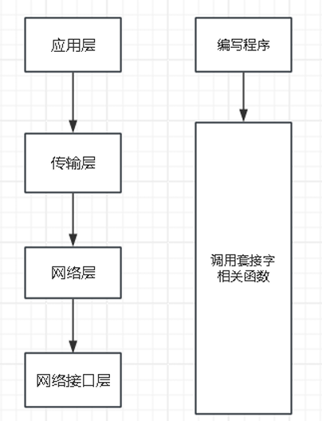

# TCP协议
* 面向连接的协议，这意味着在数据传输开始之前，必须首先建立连接 
# UDP协议
* 无连接的协议，它不需要在数据传输前建立连接，数据包（称为数据报）可以随时发送到另一个设备

# 套接字（socket）网络编程
## 网络套接字编程
### 网络套接字编程是什么？
* 网络套接字编程是一种方式，使得不同的程序之间能够进行网络通信，通常涉及数据在不同的计算机之间的传输。套接字（Socket）是计算机网络数 据传输的一个抽象层，它为我们提供了发送和接收数据的方式(编程语法)。 通过网络套接字编程，我们可以实现不同设备之间或同一设备上的不同进程（或线程）之间的数据交换。根据数据传输使用协议的不同分为两种套接字编程

### 套接字是什么？
* 套接字是一种抽象概念，用于描述不同计算机上的程序（或同一计算机上 的不同进程）如何通过网络进行数据交换。在程序中，套接字表现为一个 包含IP地址、端口号以及指定的协议（例如TCP或UDP）的数据结构。程序 双方都会有一个套接字来描述该程序本身，方便在数据传输中进行身份确 认，即一个套接字指向客户端，另一个套接字指向服务器。 
* c语言提供了一套以套接字为核心的内置函数，用于开发者进行网络数据通信。函数内部隐藏了发送数据的细节，开发者不需要关心底层网络协议 的运作，简化了网络编程难度。

* **注意：** 因为套接字编程是需要开发者自己编写程序，无法使用浏览器，所以采用c/s架构来编写。也就是说会有一个客户端程序和服务器端程序。 
* **客户端：** 负责链接服务器端以及接受服务器返回的数据，当然也可以发送数据给服务器去处理。 
* **服务器：** 负责接受和处理客户端连接的请求以及发送数据给客户端，也可以接受客户端发送过来的数据，服务器必须先运行起来，才能接收客户端的数据。
### 套接字的分类
* **流式套接字(SOCK_STREAM)：** 提供了一个面向连接、可靠的数据传输服务,数据无差错、无重复的 发送且按发送顺序接收。内设置流量控制,避免数据流淹没慢的接收 方。数据被看作是字节流,无长度限制。TCP套接字推荐使用 
* **数据报套接字(SOCK_DGRAM)：** 提供无连接服务。数据包以独立数据包的形式被发送,不提供无差错 保证,数据可能丢失或重复,顺序发送,可能乱序接收。推荐UDP使用 
* **原始套接字(SOCK_RAW)：** 可以对较低层次协议如IP、ICMP直接访问。使用的很少
## TCP套接字
### 概念
* tcp套接字是指使用tcp协议的网络套接字编程，意味着发送的数 据能准确无误地从一个端点传输到另一个端点。而tcp本身是一种面向连接的、可靠的、基于字节流的传输层通信协议。在应用层看来，TCP套接字提供了一个端到端的通信通道，允许两台主机上的应用程序交换数据流。
### 特点
* **可靠性：** TCP提供可靠的数据传输服务，它确保数据正确无误地从发送端传 输到接收端 
* **错误检测：** TCP通过校验和来检测数据在传输过程中的任何错误。如果检测 到错误，相关数据包可以被丢弃并要求重新发送 
* **拥塞控制：** TCP能够监测网络中的拥塞，自动调整数据发送的速率来减少网络的负担 
* 基于tcp以上的特点，我们在发送数据时，基本只需要考虑业务和代码的逻辑性，其他问题套接字会帮我们解决。
### 函数
#### 头文件
```c
//编写网络程序时候需要以下三个头文件，都需要用到缺一不可
#include <sys/socket.h>
#include <netinet/in.h>
#include <arpa/inet.h>
```
#### 定义一个套接字 socket()
```c
int socket(int domain, int type, int protocol);
```
* **参数:** 
	* domain：指定套接字使用的协议族。常见的协议族有 AF_INET（IPV4），AF_INET6 （IPv6），AF_UNIX（本地通信，使用UNIX文件系统的路径名）
	* type：套接字数据传输的类型信息。SOCK_STREAM （提供顺序化的、可靠的、双向的、基于连接的字节流，使用TCP协议） SOCK_DGRAM （支持无连接的数据包服务，使用UDP协议） 
	* protocol：计算机间通信中使用的协议信息。通常是 IPPROTO_TCP 用于 TCP 套接字， IPPROTO_UDP 用于 UDP 套接字。如果 type 或 domain 能唯一确定协议，这个参数也可以设置为0，让系统自动选择合适的协议 
* **返回值:** 
	* 成功: 返回文件描述符
	* 失败: 返回-1
#### struct sockaddr_in
```c
	struct sockaddr_in server;
    server.sin_family=AF_INET;
    server.sin_port=htons(port);
    server.sin_addr.s_addr=INADDR_ANY;
```
* **概念：** 用于描述一个网络通信地址，包含了地址相关信息，一般会配合 connect()或accept() 进行使用 
* **组成：**
	* sin_family : 地址家族（Address Family），AF_INET指的是IPv4网络协议，AF_INET6指的是IPv6协议
	* sin_port : 16位的端口号，存储网络字节顺序（通常使用 htons() 函数来设置此值，确保字节顺序正确）。
	* sin_addr : 32位IP地址，存储网络字节顺序。其下有一个成员 s_addr ，表示一个无符号长整型的IP地址。
```c
//地址格式转换函数
char *ip = inet_ntoa(client.sin_addr);//从sockaddr中解析出人可以看懂的的ip地址
int port = ntohs(client.sin_port);//从sockaddr中解析出人可以看懂的的端口

server.sin_addr.s_addr=INADDR_ANY;//代表可以接受任何IP连接

server.sin_addr.s_addr = inet_addr("192.168.114.55");//直接转换ip的形式
server.sin_addr.s_addr=inet_addr(IP);//把IP字符串直接填入sockaddr中的形式

server.sin_port = htons(8081);//直接填写端口号的形式
server.sin_port=htons(port);//把字符串port转换成sockaddr所能看懂的端口号
```
#### 绑定端口 bind()
```c
int bind(int sockfd, struct sockaddr *myaddr, socklen_t addrlen);
```
* **参数：**
	* int sockfd：套接字文件描述符，是通过调用socket()创建的。
	* const struct sockaddr \*addr：一个指向 sockaddr 结构的指针，该结构保存了要关联到套接字的地址（包括IP地址和端口号）。通常会使用特定于地址族的结构体（例如对于IPv4是 struct sockaddr_in，而对于ipv6是struct sockaddr_in6），并将其强制转换为 sockaddr 类型的指针。
	* struct socklen_t addrlen：该地址的长度，对于IPv4是 sizeof(struct sockaddr_in)，对于IPv6是sizeof(sockaddr_in6)
* **返回值：** 成功时返回0  失败时返回-1
#### 监听端口 listen()
```c
int listen(int sockfd, int backlog);
```
* **参数：
	* int sockfd ：套接字文件描述符，是已经绑定到一个本地地址的套接字。 
	* int backlog ：这个参数定义了套接字可以排队的最大连接数。 具体来说，它指定了内核中待处理的连接队列的大小，队列满了之 后，内核会拒绝多余的连接请求。
* **返回值：** 成功时返回0 失败时返回-1
#### 连接服务器 connect()
```c
int connect(int sockfd, const struct sockaddr *addr, socklen_t addrlen);
```
* **用于连接某个服务器**
* **参数：** 
	* int sockfd ：这是指向一个打开的socket的套接字描述符，该 socket是通过调用 socket() 函数创建的。 
	* const struct sockaddr \*addr：这是一个指向 struct sockaddr 结构体的指针，该结构体包含了目标服务器的地址和端口信息。通常会使用特定于地址族的结构体（例如对于IPv4是 struct sockaddr_in，而对于ipv6是struct sockaddr_in6），并将其强制转换为 sockaddr 类型的指针传递给 connect 。
	* socklen_t addrlen ：这是上述addr指向的地址结构的字节长度。 
* **返回值：**
	* 连接建立成功， connect 函数返回 0。 
	* 连接失败，返回 -1，并且 errno 被设置为具体的错误代码
#### 等待客户端连接 accept()
```c
int accept(int sockfd, struct sockaddr *addr, socklen_t *addrlen);
```
* **会阻塞程序执行并等待客户端的连接，有客户端连接后才执行后续的代码**
* **参数：**
	* int sockfd ：这个参数是由 socket() 函数返回的监听socket的 文件描述符。该监听socket应已经绑定到一个本地地址和端口上， 并且已经在这个端口上监听连接，即在之前已经调用过 bind() 和 listen() 函数。 
	* struct sockaddr \*addr ：这是一个指向 struct sockaddr 结构体的指针，这个结构体在函数调用成功后将被填充为连接服务器的客户端的地址信息。实际上当 accept 函数被调用时，系统从监听队列中取出排在最前面的连接请求，创建一个新的套接 字，并将请求连接的客户端的地址信息填充到这个结构体中。通常会使用特定于地址族的结构体（例如对于IPv4是 struct sockaddr_in，而对于ipv6是struct sockaddr_in6），并将其强制转换为 sockaddr 类型的指针传递给 connect 。
	* socklen_t \*addrlen ：这是一个指向 socklen_t 类型变量的 指针，该变量在调用前应该被初始化为addr所指向的地址结构体的大小。 accept 函数成功返回后，这个变量将被设置为实际接收到的地址的长度。 
* **返回值 ：**
	* 成功时，返回一个新的套接字socket文件描述符，用于与申请连接的客户端进行通信。此描述符代表一个已经建立的连接。 
	* 错误时，返回 -1，并且 例子 errno 被设置为相应的错误码。
#### 发送 write()
```c
ssize_t write(int fd, const void *buf, size_t count);
```
* **用于向套接字文件描述符或者任何文件中写入数据**
* **参数：**
	* int fd ：文件描述符，用于标识一个打开的文件或套接字。 
	* const void \*buf ：指向一个包含要写入数据的缓冲区的指针。 
	* size_t count ：指示要写入的字节数。 
* **返回值：**
	* 成功时，返回写入的字节数。在许多系统中， ssize_t 是和 size_t 一样的宽度，但是是有符号的。例如，在一个32位系统 上，size_t 通常是一个32位无符号整数，而 ssize_t 是一个32 位有符号整数 
	* 失败时，返回-1，并设置 errno 以指示错误类型。 
* **注意：** 它们都定义在头文件中，这点对于普通文件I/O和 套接字I/O都是一样的。当在套接字上使用 read 和 write 时，实际上是在进行网络I/O操作，这些操作底层由操作系统的网络堆栈来处理。 而在普通文件上使用这些函数时，操作的是文件系统I/O。
#### 接收 read()
```c
ssize_t read(int fd, void *buf, size_t count);
```
* **用于从套接字描述符或任何文件描述符中读取数据**
* **参数：**
	* int fd ：文件描述符，用于标识一个打开的文件或套接字。 
	* void \*buf ：指向一个缓冲区的指针，这个缓冲区用于存储从文件描述符读取的数据。 
	* size_t count ：指示要读取的最大字节数。
* **返回值：**
	* 成功时，返回读取的字节数，如果到达文件末尾，则返回0。 
	* 失败时，返回-1，并设置 errno 以指示错误类型。
#### 关闭套接字 close()
```c
int close(int fd);
```
* **关闭套接字或者文件**
* **参数：**
	* int fd ：要关闭的文件描述符或套接字的标识符。 
* **返回值：**
	* 成功时， close 函数返回 0。 
	* 失败时，返回 -1 并设置全局变量 errno 以指示错误的原因。
### 示例-群聊服务器
```c
#include <stdlib.h>
#include <stdio.h>
#include <unistd.h>
#include <pthread.h>
#include <arpa/inet.h>
#include <sys/socket.h>
//用于互联网地址族，包括 sockaddr_in 结构和 IP 地址定义。
#include <netinet/in.h>
#include <time.h>
#include <string.h>

char * getNowTime(){
	//1. 拿到时间的秒数
	time_t nowTime;
	time(&nowTime);//传指针
	//2. 通过秒数拿到对应的时间结构体指针
	struct tm *now  = localtime(&nowTime);
	//3. 通过strftime将得到的时间利用格式化字符串得到最后的时间字符串
	char *timestr =malloc(100);
	strftime(timestr,100,"%Y/%m/%d %H:%M:%S",now);
	return timestr;
}

/*链表*/
//定义单个用户结构体，需要保存的数据
typedef struct{
    char name[16];
    char IP[16];
    int port;
    int connect_fd;
}User;
//定义每一个节点需要包含的信息
typedef struct Node{
    User user;
    struct Node *next;
}Node;

//创建一个新节点并初始化把第一个数据填进去并返回新节点的地址
Node *createNode(User Data){
    Node *newNode = malloc(sizeof(Node));
    newNode->user=Data;
    newNode->next=NULL;
    return newNode;
}
//在链表尾部追加新元素
void addData(Node **head,User Data){
    Node *newnode = createNode(Data);
    if(*head==NULL){
        *head=newnode;
    }else{
        Node *current =*head;
        while(current->next!=NULL){
            current=current->next;
        }
        current->next=newnode;
    }
}
//删除指定位置的节点,用connect_fd来查找
void delNode(Node **head,int connect_fd){
    if(*head == NULL){return;}
    Node *current = *head;
    Node *prev = NULL;
    while(current->next!=NULL && connect_fd!=current->user.connect_fd){
        prev = current;
        current = current->next;
    }
    if(connect_fd==current->user.connect_fd){
        if(prev==NULL){
            *head=(*head)->next;
        }
        else{
        prev->next=current->next;    
        }
        free(current);
    }
}
/**/

int port=8080;
void* worker(void *args);
Node *head = NULL;
void sendAll(char *msg,int connect_fd);
pthread_mutex_t mutex = PTHREAD_MUTEX_INITIALIZER;

int main(){
    //1. 调用socket()创建一个套接字，并指定ip地址和使用协议，得到一个套接字文件描述符
    int server_fd = socket(AF_INET, SOCK_STREAM, 0);
    if(server_fd<0){
        perror("服务器套接字创建失败");
        exit(0);
    }
    //2.设置端口信息
    struct sockaddr_in server;
    server.sin_family=AF_INET;
    server.sin_port=htons(port);
    server.sin_addr.s_addr=INADDR_ANY;
    //3.绑定端口
    if(bind(server_fd, (struct sockaddr *)&server, sizeof(struct sockaddr_in))<0){
        perror("绑定端口失败");
        exit(0);
    }
    //4.监听端口，等待连接
    if(listen(server_fd, 1)<0){
        perror("打开服务器端口监听失败");
        exit(0);
    }else{
        printf("服务器正在监听端口%d\n",port);
    }
    //5.等待客户端的连接
    struct sockaddr_in client;
    socklen_t len =sizeof(client);
    int connect_fd;
    while( (connect_fd=accept(server_fd, (struct sockaddr *)&client, &len) )>0){
        User data={0};
        char *ip = inet_ntoa(client.sin_addr);
		int port = ntohs(client.sin_port);
        data.connect_fd=connect_fd;
        strcpy(data.IP,ip);
        data.port=port;
        pthread_t pid;
        pthread_create(&pid,NULL,worker,&data);
    }
    //6.结束通信后关闭套接字文件描述符
    close(server_fd);
    close(connect_fd);
    return 0;
}

void *worker(void *args){
    User *demo = (User *)args;
    User data=*demo;
    char name[16];
    read(data.connect_fd,name,sizeof(name)-1);//读取昵称
    strcpy(data.name,name);
    addData(&head,data);
    while(1){
        char msg[100];
        int count=read(data.connect_fd,msg,sizeof(msg)-1);//等待客户端发送信息
        if(count>0){
            msg[count]='\0';
            char sendmsg[200];            
            char *nowtime;
            nowtime=getNowTime();
            snprintf(sendmsg,sizeof(sendmsg),"%s %s:%s",data.name,nowtime,msg);
            sendAll(sendmsg,data.connect_fd);
            printf("%s\n",sendmsg);
        }else{
            pthread_mutex_lock(&mutex);
            printf("%s下线\n",data.name);
            delNode(&head,data.connect_fd);
            pthread_mutex_unlock(&mutex);
            break;
        }
    }
}

void sendAll(char *msg,int connect_fd){
Node *current=head;
while(current!=NULL){
        if(current->user.connect_fd!=connect_fd){
            write(current->user.connect_fd,msg,strlen(msg));
        }
        current = current->next;
    }
}
```
### 示例-群聊客户端
```c
#include <stdlib.h>
#include <stdio.h>
#include <unistd.h>
#include <arpa/inet.h>
#include <sys/socket.h>
#include <string.h>
#include <pthread.h>
//用于互联网地址族，包括 sockaddr_in 结构和 IP 地址定义。
#include <netinet/in.h>

int port=8080;
char IP[100]="";
void *readAll(void *args);

int main(){
    //1. 调用socket()创建一个套接字，并指定ip地址和使用协议，得到一个套接字文件描述符
    int cilent_fd = socket(AF_INET, SOCK_STREAM, 0);
    if(cilent_fd<0){
        perror("客户端套接字创建失败");
        exit(0);
    }
    //2.设置要连接的服务器的信息
    puts("请输入要连接的服务器IP");
    scanf("%s",IP);
    struct sockaddr_in server;
    server.sin_family=AF_INET;
    server.sin_port=htons(port);
    server.sin_addr.s_addr=inet_addr(IP);
    //3.连接服务器
    socklen_t len =sizeof(server);
    if(connect(cilent_fd, (struct sockaddr *)&server, len)<0){
        perror("连接失败");
        exit(0);
    }else{
        puts("连接成功");
    }
    //4.连接成功，向服务端发送数据
    char name[16];
    puts("请输入名字：");
    scanf("%s",name);
    write(cilent_fd,name,strlen(name));
    pthread_t pid;
    pthread_create(&pid,NULL,readAll,&cilent_fd);
    puts("请输入要发送的信息：");
    while(1){
        char msg[100]="";
        scanf("%s",msg);
        write(cilent_fd,msg,strlen(msg));//阻塞并等待从抽象出来的文件中读取信息（也就是等待客户端发送信息）
        sleep(1);
    }
    //5.结束通信后关闭套接字文件描述符
    close(cilent_fd);
    return 0;
}

void *readAll(void *args){
    int *demo = (int *)args;
    int client_fd=*demo;
    while(1){
        char msg[100]="";
        read(client_fd,msg,sizeof(msg)-1);
        puts(msg);
    }
}

```