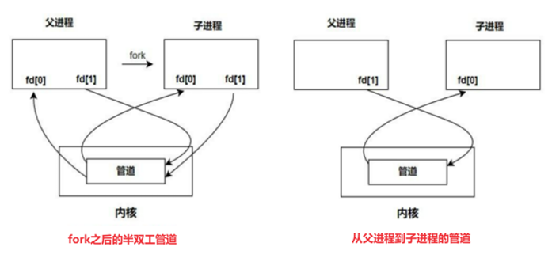

# 消息队列
## 1. 概念
* 消息队列是一种在进程间传递消息的通信机制，它允许一个或多个进程向 队列写入消息，同时一个或多个进程可以从队列读取消息。
* 消息队列是全双工通信
## 2. 特点
* 消息队列是面向记录的，其中的消息具有特定的格式、类型以及优先级。 
* 消息队列独立于发送与接收进程。进程终止时，消息队列及其内容并不会被删除（他只是借助一个文件实现一个特殊的key值保证一个消息队列的唯一性，而不是说把消息存在这个文件里，实际上他在系统内核的消息队列里存着！！！重启系统，内存里的东西就丢失了） 
* 消息队列可以实现消息的随机查询,消息不一定要以先进先出的次序读 取,也可以按消息的类型读 取。
## 3. 优缺点
* **优点** 
	* 能够实现消息的异步传递。 
	* 消息是按照顺序逐个处理的，避免了数据的混乱。 
	* 可以实现复杂的通信，如多个进程可以同时向队列发送和接收消息。 
	* 支持消息的选择性接收，进程可以根据消息的类型选择读取。
* **缺点（主要）** 
	* 系统资源限制：消息队列是一种系统级资源，受到操作系统管理和限制。每个消息队列的大小和系统中可以创建的队列数量通常都有上限 
	* 内容固定：一旦消息被发送到队列中，通常就无法被修改。如果发送过程中出现错误，就需要发送新的更正消息
	* 同步问题：消息队列本身并不提供同步机制。当多个进程同时访问同一 消息队列时，需要额外的同步操作来管理消息的发送和接收
## 4. 相关函数
### （1）头文件
```c
#include <sys/msg.h>
#include <sys/ipc.h>
#include <sys/types.h>
```
### （2）ftok
```c
key_t ftok(const char *pathname, int proj_id);
```
* **作用：** 
	* 根据一个可访问的文件路径生成一个唯一的值，用于消息队列作为队列的id值进行使用。 ftok 是一个Unix标准的函数，它用于将一个已存在文件的路径和一个整数标识符转换成一个 System V IPC 键值。这个键值通常用于 msgget 、 semget 或 信号量集或共享内存段
* **参数** 
	* pathname ：是一个指向以 null 结尾的字符串的指针，该字符串应代表文件系统中的一个有效文件名的路径。这个文件必须是可访问的，因为 ftok 会使用文件的元数据来生成 IPC 键值。 
	* proj_id ：是一个整数，用作生成键值的另一个输入。为了获得 唯一的键值，不同的 proj_id 应该和不同的 pathname 一起 使用。该参数的取值不能为0，并且仅使用其最低的 8 位（即一 个字节），因此通常其取值范围为 1 到 255 之间。 
* **返回值 **
	* 成功时， ftok 返回一个类型为 key_t 的非零值，即生成的 IPC 键值。 
	* 失败时，返回 -1，并且 errno 会被设置为指明错误原因的错误码。
### （3）msgget
```c
int msgget(key_t key, int msgflg);
```
* **作用：** 用来创建或访问一个消息队列。
* **参数**
	* key : 消息队列的键值，可以是IPC_PRIVATE，或者用ftok()函数 生成。 
	* msgflg : 是一个权限标志，表示消息队列的访问权限，它与文件的访问权限一样。msgflg可以与IPC_CREAT做或操作，表示当key所命名的消息队列不存在时创建一个消息队列，如果key所命名的消息队列存在时，IPC_CREAT标志会被忽略，而只返回一个标识符。
	* 关于linux权限标志可以参考chmod指令具体查询
* **返回值**：成功：消息队列标识符（msqid)（自定定义一个int用来接收就好了）   失败：返回-1
### （4）msgsnd
```c
int msgsnd(int msqid, const void *msgp, size_t msgsz, int flag)
```
* **作用：** 用来向消息队列发送消息。
* **参数** 
	* msqid : 上面使用msgget 函数后返回的消息队列标识符。 
	* msgp : 是一个指向准备发送消息的指针，但是消息的数据结构却有一定的要求，指针msg_ptr所指向的消息结构一定要是以一个长整型成员变量开始的结构体，接收函数将用这个成员来确定消息的类型。所以消息结构要定义成这样：
```c
struct my_message {

    long int message_type;//type用于在发送和接手的时候确定这个消息的类型

    /* The data you wish to transfer */

};
```
 * 
	* msgsz : 消息的大小（是真正发送过去的大小，而不是消息结构体的大小）。 
	* flag : 用于控制当前消息队列满或队列消息到达系统范围的限制时将要发生的事情，如0（阻塞方式发送）IPC_NOWAIT（非阻塞发送）

* **返回值：** 成功返回0，失败返回-1
### （5）msgrcv
```c
ssize_t msgrcv(int msqid, void *msgp, size_t msgsz, long msgtyp, int msgflg);
```
* **作用：** 从消息队列中接收消息。
* **参数** 
	* msqid : 上面使用msgget 函数后返回的消息队列标识符。 
	* msgp : 用于接收消息的缓冲区，同上，得是一个结构体指针。 
	* msgsz : 是msgp指向的消息的长度，注意是消息的长度，而不是整个结构体的长度，也就是说msg_sz是不包括长整型消息类型成员变量的长度。（单位：字节）
	* msgtyp : 可以实现一种简单的接收优先级。如果msgtype为0，就获取队列中的第一个消息。如果它的值大于零，将获取具有相同消息类型的第一个信息。如果它小于零，就获取类型等于或小于msgtype的绝对值的第一个消息。
		* =0：收到的第一条消息，任意类型。
		- >0：收到的第一条msgtyp类型的消息。
		- <0：收到的第一条最低类型（小于或等于msgtyp的绝对值）的消息。*
	* msgflg : 用于控制当前消息队列满或队列消息到达系统范围的限制时将要发生的事情，如0（阻塞方式接收）IPC_NOWAIT（非阻塞接收）
* **返回值：** 成功返回放到缓冲区中的字节长度，失败返回-1
### （6）msgctl
```c
int msgctl(int msgid, int command, struct msgid_ds *buf);
```
* **作用：** 控制消息队列的某些属性，如删除队列等
* **参数** 
	* msqid：消息队列的标识符，由 msgget 函数返回。 
	* command：指定要执行的操作。可以是以下几种之一： 
		* IPC_STAT：获取消息队列的当前状态，将状态信息存储在 buf 指向的 msqid_ds 结构中。 
		* IPC_SET：设置消息队列的属性，根据 buf 指向的 msqid_ds 结构中的值来更新消息队列的属性。只有特定的字段可以被 设置，包括 msg_perm.uid、msg_perm.gid、 msg_perm.mode 和 msg_qbytes。 
		* IPC_RMID：立即删除消息队列，并唤醒所有等待该队列的进 程。这个操作不需要 buf 参数。 
		* IPC_INFO（非标准）：获取系统范围内消息队列的限制和参 数信息。 
		* MSG_INFO（非标准）：获取系统范围内消息队列的使用统 计信息。 
		* MSG_STAT（非标准）：获取消息队列的索引信息，类似于 IPC_STAT，但是是通过消息队列的索引号而不是 msqid。
	* buf：指向 msqid_ds 结构的指针，用于在 IPC_STAT 和 IPC_SET 操作中传递和接收消息队列的属性。msqid_ds 结构通常包含以下字段： 
		* msg_perm：消息队列的权限和所有者信息。 
		* msg_qnum：队列中的消息数量。 
		* msg_qbytes：队列允许的最大字节数。 
		* msg_lspid：最后发送消息的进程的进程ID。 
		* msg_lrpid：最后接收消息的进程的进程ID。 
		* msg_stime：最后发送消息的时间。 
		* msg_rtime：最后接收消息的时间。 
		* msg_ctime：最后更改队列的时间。 成功返回0， 失败返回-1
## 5. 使用例子
### 消息队列-写
```c
#include <stdio.h>
#include <stdlib.h>
#include <sys/ipc.h>
#include <sys/msg.h>
#include <sys/types.h>
#include <string.h>

typedef struct Message{
	long type;//消息类型
	char text [100];//具体发送的数据
}Message;

int main(){
	//1. 先通过ftok拿到唯一的key
	key_t key  = ftok("aaa",66);
	//2. 利用msgget来拿到消息队列的msqid
	int msqid = msgget(key,IPC_CREAT | 0664);
	//3. 发送数据：发送成功，数据会保存到消息队列文件，其他进程就可以读
	while(1){
	Message m1 = {1,""};
	puts("请输入要发送的数据");
	scanf("%s",m1.text);
	int sendCount = msgsnd(msqid,&m1,sizeof(m1.text),0);
	if(sendCount ==0){
		puts("发送成功");
	}else if(sendCount ==-1){
		puts("发送失败");
	}
	}
    return 0;
}
```

### 消息队列-读
```c
#include <stdio.h>
#include <stdbool.h>
#include <string.h>
#include <pthread.h>
#include <unistd.h>
#include <stdlib.h>
#include <sys/msg.h> 

typedef struct Message{
	long type;//消息类型
	char text [100];//具体发送的数据
}Message;

int main(){
	//1. 先通过ftok拿到唯一的key
	key_t key  = ftok("aaa",66);
	//2. 利用msgget来拿到消息队列的msqid
	int msqid = msgget(key,IPC_CREAT | 0664);
	//3. 接受数据
	Message m1 = {0};
	while(1){
	int sendCount = msgrcv(msqid,&m1,sizeof(m1),1,0);
	if(sendCount >0){
		puts(m1.text);
	}else if(sendCount ==-1){
		puts("接受失败");
	}
	memset(&m1,0,sizeof(m1));//清空m1,便于重新接收
	}
    return 0;
}

```
# 管道
## 1. 管道是什么？
* 管道，是 UNIX 系统IPC标准的形式。管道是进程间通讯的一种实现。 管道分为两种：有名管道和无名管道

## 2. 无名管道
* **概念：** 无名管道是管道通信中的一种，通常用于具有亲缘关系（如父子进程）的 进程间通信。 
* **特点：**
	* 主要用于具有亲缘关系（如父子进程或兄弟进程）的进程 
	* 无名管道是半双工的，即数据只能在一个方向上流动。通常父进程写入 管道，子进程从管道读取，或者相反
	* 无名管道的生命周期通常随着相关进程的终止而结束
* **为什么叫无名：** 无名管道只存在于内存之中，系统自动生成了其文件描述符，其他进程无法获取这个管道来操作
### （1）头文件
```c
#include <unistd.h>
```
### （2）创建管道
```c
int fd[2]
//创建一个文件描述符数组，fd[0]是读，fd[1]是写
int pipe(fd);
//创建一个单方向的无名管道（半双工通信），要关闭管道只需将这两个文件描述符关闭即可。
```
* **作用：** 创建一个单方向的无名管道（半双工通信），要关闭管道只需将 这两个文件描述符关闭即可。 
* **参数：** fd 指定一个有两个整型元素的数组名字（也就是文件描述符数组）。 pipefd[0] 指向管道读端，pipefd[0]为读而打开 pipefd[1] 指向管道的写端，pipefd[1]为写而打开 
* **返回值：** 成功返回0 失败返回-1
### （3）示例代码
```c
#include <stdio.h>
#include <unistd.h>
#include <pthread.h>
#include <stdlib.h>
#include <sys/types.h>
#include <wait.h>

int main(){
    int fd[2];
    pid_t pid;
    char buf[100];
    if (pipe(fd)<0){
        perror("管道创建失败");
        exit(0);
    }
    pid = fork();
    if(pid<0){
        perror("进程创建失败");
        exit(0);
    }
    if(pid>0){//pid>0代表在父进程
        close(fd[0]);//在写的时候必须把读的端口关掉，不然会出问题！！！
        write(fd[1],"Hello,world!",13);
        wait(NULL);
    }else if(pid==0){//pid==0代表在子进程
        close(fd[1]);//在读的时候必须把写的端口关掉，不然会出问题！！！
        read(fd[0],buf,100);
        printf("子进程接收到的信息: %s\n", buf);
    }
    return 0;
}
```
## 3. 有名管道
* 概念：进程间通信的一种。因其数据传输的特点为先入先出，使用有名管道进行 通信的模式又称FIFO模式或。
* 特点 
	* 有名管道则可以用于任意两个进程之间的全双工通信，无论它们之间是 否存在亲缘关系 
	* 有名管道在文件系统中有一个具体的名字。任何知道管道名字的进程都 可以使用该管道进行数据通信 
	* 有名管道的生命周期和使用它的进程有关，除非被显式的删除或者最后一个在使用他的进程结束就被释放掉了，在C语言中可以用调用remove进行删除
### （1）头文件
```c
#include <sys/stat.h>
#include <sys/types.h>
```
### （2）创建管道
```c
int mkfifo(const char *pathname, mode_t mode);
```
* **功能：** 创建一个有名管道 
* **参数：**
	* pathname: 指定要创建的文件的名字(管道类型的文件)。 
	* mode: 指定管道文件的权限 例如：0666 
* **返回值：** 成功：返回 0 失败：返回-1; errno被设置为相应的错误值
### （3）示例代码
#### 有名管道-写
```c
#include <stdio.h>
#include <unistd.h>
#include <pthread.h>
#include <stdlib.h>
#include <sys/types.h>
#include <wait.h>
#include <sys/stat.h>
#include <fcntl.h>
#include <string.h>

int main(){
    int re =mkfifo("myfifo",0664);
    if(re<0){
        perror("创建失败");
    }
    int fd=open("myfifo",O_RDWR); 
    //O_RDWR代表读写方式打开文件
    //OPEN函数在fcntl.h库文件里，第一个代表文件路径，第二个是打开方式，返回值是文件描述符
    
    char data[100]="hello 有名管道";
    while(1){
        write(fd,data,strlen(data));
        sleep(1);
    }
    close(fd);
    return 0;
}
```
#### 有名管道-读
```c
#include <stdio.h>
#include <unistd.h>
#include <pthread.h>
#include <stdlib.h>
#include <sys/types.h>
#include <wait.h>
#include <sys/stat.h>
#include <fcntl.h>
#include <string.h>

int main(){
    int fd=open("myfifo",O_RDONLY);
    //O_RDONLY代表只读的方式打开文件
    
    char data[100]="";
    while(1){
        read(fd,data,sizeof(data)-1);
        puts(data);
    }
    close(fd);
    return 0;
}
```
# 共享内存
* 共享内存的实现是操作系统使用CPU中的MMU单元把同一个物理内存映射到不同的虚拟内存中，因此他的通信效率要高于管道和消息队列
## 使用流程
1. **头文件**
```c
<fcntl.h>：用于文件控制定义，

<sys/mman.h>：用于内存管理的定义，比如 mmap() 和 munmap() 函 数，以及 PROT_READ、PROT_WRITE、MAP_SHARED 等标志。 

<sys/stat.h>：用于文件状态的定义，包括权限标志，比如 0666。 

<unistd.h>：用于定义POSIX标准符号常量和函数声明，比如 ftruncate() 和 close()。
```
2. 使用 shm_open() 函数创建或打开一个共享内存对象 
3. 使用 mmap() 将共享内存映射到进程地址空间,同时返回共享内存的首字 节地址 
4. 对指针进行操作。任何进程都可以通过该共享内存fd进行处理 
5. 如果要保证进程间的访问顺序，则需要考虑同步问题。比如使用信号量 
6. 访问完毕并确认不在使用该共享内存，需要使用 mmap 、 close、shm_unlink 等函数来删除共享内存 
7. 编译时需要加上-lrt ,因为共享内存需要用到rt库。rt是实时库，它包含了一些和实时操作系统特性相关的函数。
## 相关函数
### （1）创建或者打开一个共享内存
```c
int shm_fd = shm_open("./my_shm", O_CREAT | O_RDWR, 0664);
```
* "./my_shm" 是共享内存对象的名称，以斜杠开头。本身不是指的一个文件，只是感觉像在读写一个文件（为了便于程序员使用而抽象出来的这么一个文件罢了） 
* O_CREAT | O_RDWR 指定了创建和读写权限。 
* 0664 是文件权限
### （2）修改共享内存的大小
```c
ftruncate(shm_fd, 4096); // 设置大小为4KB
```
* 注意：如果不设置，那么字节数为0，直接读写会报错
### （3）将共享内存映射到进程的地址空间
```c
void* ptr = mmap(0, 4096, PROT_READ | PROT_WRITE, MAP_SHARED, shm_fd, 0);
```
* 0或NULL:表示共享内存的起始地址由操作系统自行设置，我们不手动设 置共享内存空间的起始地址 
* 4096：表示共享内存空间字节总大小 
* PROT_READ | PROT_WRITE 允许读写操作。 
* MAP_SHARED 表示多个进程共享这段内存。
```c
struct User{
	name[100];
	phone[100];
}
//可以这样定义一个用于接收共享内存地址的指针
struct User *ptr;
ptr = mmap(0, 4096, PROT_READ | PROT_WRITE, MAP_SHARED, shm_fd, 0);
```
### （4）关闭共享内存
```c
munmap(ptr, 4096); 
close(shm_fd); 
shm_unlink("./my_shm");
```
* munmp: munmap 函数用于解除内存映射。 ptr 是指向之前通过 mmap 函数映射到进程地址空间的共享内存区域的指针，而 4096 是该映射区 域的大小（以字节为单位） 
* close 函数用于关闭文件描述符。 是在调用 shm_fd 是一个文件描述符，通常 shm_open 时获得的，用于引用一个打开的共享内存对象 
* shm_unlink 函数用于删除共享内存对象。当共享内存对象不再需要 时，通过名称将其删除（在这里是 "./my_shm" ）。但注意，这句话不会马上真正删除共享内存，会在所有相关进程都结束后才会结束。同时 调用后的新的进程就无法再通过该共享内存名称来访问，目前正在使用 共享内存的进程不受影响。同时如果进程只是临时退出，下一次要继续使用同一个共享内存，那么这一句不要书写
# 各种通信方式的对比
1. 管道适用于简单的通信
2. 消息队列适用于多对多的通信，如聊天室等等
3. 共享内存效率很高，而且只要不关机永远都在，只要不删除就可以在不同进程内使用。