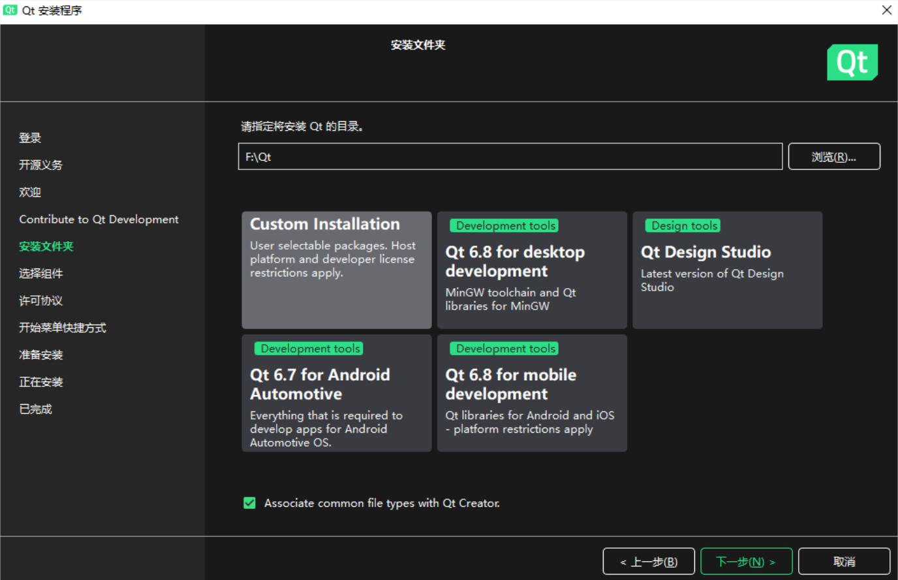
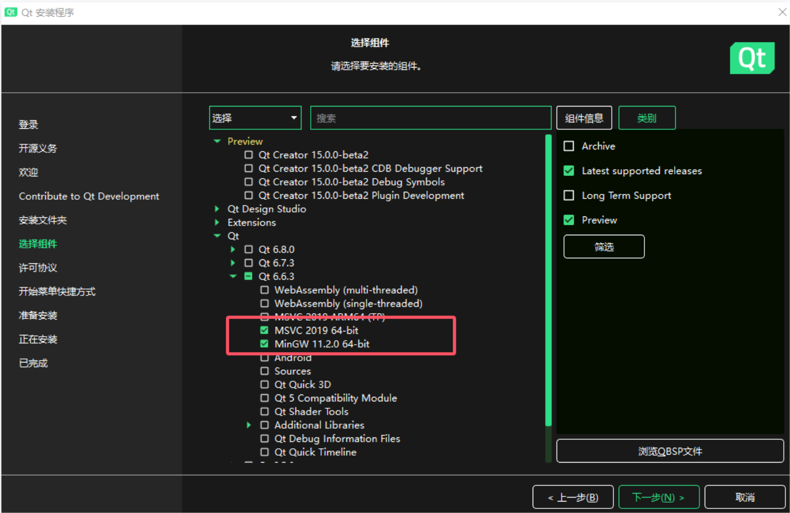

# 一、Qt简介

> Qt 是一个跨平台的应用程序开发框架，旨在简化GUI（图形用户界面）应用程序的开发工作，广泛应用于桌面应用程序、办公软件、车载系统、工控人机界面、医疗设备界面、游戏开发、建模软件等领域的开发。

Qt的主要特点：

- **跨平台支持**：Qt允许开发者编写一次代码，然后可以在多个操作系统上运行，包括Windows、macOS、Linux等。原理是一次编码，处处编译。上层API接口是一样的，针对不同平台提供了对应的程序包，使开发者可以在不知道底层具体实现细节的情况下编写跨平台的应用程序。

- **丰富的GUI组件**：Qt提供了大量的图形用户界面（GUI）组件和工具，使开发者能够轻松构建各种复杂的用户界面。无论是桌面应用程序、移动应用还是嵌入式系统，Qt都能满足各种需求。

- **模块化的设计**：Qt的类库中的类根据功能分为各种模块，这些模块为开发者提供了广泛的功能，如网络编程、数据库访问、Web浏览器功能、音频和视频处理等。

- **易用性和强大的社区支持**：Qt的API设计被认为是易用和直观的，而且其官方文档和社区资源也非常丰富，为开发者提供了大量的帮助。

# 二、环境搭建

## 1. Qt Creator开发工具安装包下载

***
**[https://www.qt.io/download-open-source](https://www.qt.io/download-open-source)**

***

- 打开后拖动下载QT在线安装工具

## 2. 安装

1. 使用以下方式在安装器中配置使用阿里镜像源下载 ，打开windows Powershell，进入到安装器所在目录。

2. 执行命令并指定源，键入如下命令

```powershell
.\qt-online-installer-windows-x64-4.8.0.exe --mirror https://mirrors.ustc.edu.cn/qtproject
```

**注意：** 文件名取决于你下载的在线安装工具名，文件名前，一定要加“.\”，mirror前面两个-的意思是回车后，自动打开安装器。

3. 输入/注册账号邮箱和密码

4. 安装与设置

5. 注册账号后，点击下一步。

6. 勾选第二个，非商业用户。

7. 更改安装路径，安装方式选择**" custom installation "**，这样用户自行勾选安装组件。



8. **勾选组件：** 默认选项基础上，加上MinGW 11.2.2 64-bit。MinGW必选，MinGW是Minimalist GNU for Windows 的缩写，MinGW是Windows平台上使用的GNU工具集导入库的集合。



## 3. 添加或删除组件

安装完成后，如果要添加或删除组件，可以执行安装目录中的以下程序。

```powershell
.\MaintenanceTool.exe --mirror https://mirrors.ustc.edu.cn/qtproject
```

# 三、使用QT Creator开发Qt程序

## 1. 创建项目

点击QT Creator的菜单项 

→ 文件 

→ New Project 

→ Qt Widgets Application 

→ 设置好项目名称和存储路径（不要有中文路径，容易出错）

→ 构建工具选择 CMake（开源）/qmake（闭源）

→ 设置自定义窗口类的名称，选择窗口基类，有3种窗口基类可以选择：
 - QMainWindow是主窗口类，主窗口类具有菜单栏，工具栏，和状态栏。
 - QWidget是所有界面组件类的基类，QWidget可以作为独立的窗口，就是一个空白的窗口。
 - QDialog是对话框类，窗口具有对话框的显示特效，例如没有最大化按钮。

→ 勾选`Generate form`复选框，QT Creator会创建窗体（form）文件，我们就可以使用Qt Designer可视化设计窗口 UI 界面。


→ 选择翻译文件，不涉及多语言界面，使用默认即可。

→ 选择开发套件，开发套件包含了所用的编译器，一般用MinGW

## 2. 工程结构

### 2.1 `MyProject.pro`

```qmake
#
#	.pro是qmake构建工具的工程文件，如果是CMake的话就是CMakeList，后面有介绍CMake
#
# 指定了项目需要用到的基础Qt模块，这里包含了核心模块（core）和图形用户界面模块（gui）。
QT       += core gui

# 当前Qt版本是否大于4。如果是，则添加widgets模块，这是因为Qt5开始，GUI类从QtGui模块移到了QtWidgets（即widgets）模块。
greaterThan(QT_MAJOR_VERSION, 4): QT += widgets

# 设置项目采用C++17标准进行编译。
CONFIG += c++17

# 这部分是关于禁用过时API的注释说明。如果取消注释这行，将在编译时禁止使用Qt 6.0.0之前弃用的所有API，这样可以避免项目依赖已过时的功能。
# You can make your code fail to compile if it uses deprecated APIs.
# In order to do so, uncomment the following line.
#DEFINES += QT_DISABLE_DEPRECATED_BEFORE=0x060000    # disables all the APIs deprecated before Qt 6.0.0

# 声明项目的源代码文件，这里是主程序入口main.cpp和自定义Widget实现的widget.cpp。
SOURCES += \
    main.cpp \
    widget.cpp

# 声明项目所需的头文件，这里包含的是与widget.cpp配套的widget.h头文件。
HEADERS += \
    widget.h

# 声明项目使用的Qt Designer设计的UI文件，这里有一个名为widget.ui的界面文件。
FORMS += \
    widget.ui

# 这部分定义了部署规则。对于QNX系统，目标文件（编译后的可执行文件或库）将被安装到/tmp/<target>/bin目录下；对于非QNX且非Android的Unix系统，则安装到/opt/<target>/bin目录下。当target.path不为空时，会将目标文件加入到INSTALLS列表中，这样在执行make install时，会自动按指定路径进行安装。
# Default rules for deployment.
qnx: target.path = /tmp/$${TARGET}/bin
else: unix:!android: target.path = /opt/$${TARGET}/bin
!isEmpty(target.path): INSTALLS += target
```

### 2.2 `widget.h`

```cpp
/*
 * 这是一个预处理器的条件编译指令，用于防止头文件被重复包含。当第一次包含此头文件时，WIDGET_H未定义，
 * 所以#ifndef后面的表达式为真，#define WIDGET_H定义了WIDGET_H这个宏。后续再次包含此头文件时，
 * 由于WIDGET_H已经被定义，预处理器会跳过整个条件编译块内的内容，避免了类的多重声明和链接错误
 */
#ifndef WIDGET_H
#define WIDGET_H

// 包含了QWidget类的头文件，因为这里的Widget类是从QWidget派生出来的，需要使用QWidget的成员和方法
#include <QWidget>

// Qt框架中用于管理命名空间的预处理宏。宏展开后实质上开始了一个名为QT_NAMESPACE的命名空间
QT_BEGIN_NAMESPACE

// 声明了一个内部嵌套的Ui命名空间
namespace Ui {
    class Widget;
}
QT_END_NAMESPACE

// 定义了一个名为Widget的类，继承Qt的QWidget类，QWidget是一个可以显示在屏幕上的图形用户界面组件
class Widget : public QWidget
{
    // Widget类定义的第一行语句插入了一个宏Q_OBJECT，这是使用QT元对象系统的类时必须插入的一个宏。
    // 插入了这个宏之后，Widget类就可以使用信号与槽、属性等功能。
    Q_OBJECT

public:
    // 构造函数，接受一个指向父Widget的指针，默认为空。
    // 当创建一个Widget时，如果传入一个父Widget，那么在关闭父Widget时，当前子Widget也会随之销毁。
    Widget(QWidget *parent = nullptr);
    // 析构函数，当Widget对象销毁时会调用。
    ~Widget();

private:
    // 这个类是在使用Qt Creator或Qt Designer这类集成开发环境（IDE）设计用户界面（UI）时自动生成的。
    // 当你在Qt Designer中拖放控件，设计窗口布局时，IDE会根据你的设计自动生成对应的C++代码。
    Ui::Widget *ui;
};

#endif // WIDGET_H
```

### 2.3 `widget.cpp`

```cpp
#include "widget.h"
#include "ui_widget.h"

Widget::Widget(QWidget *parent)
    : QWidget(parent),
      ui(new Ui::Widget)
{
    // 窗口初始化
    // 调用setupUi方法用来根据之前在Qt Designer中设计的界面描述初始化当前窗口。
    ui->setupUi(this);
}

Widget::~Widget()
{
    delete ui;
}
```

### 2.4 main.cpp

```cpp
#include "widget.h"
#include <QApplication>

int main(int argc, char *argv[])
{
    // 创建一个应用程序对象
    QApplication a(argc, argv);

    // 创建一个Widget类的实例
    Widget w;

    // 调用Widget对象的show()方法，该方法将窗口显示在屏幕上。
    w.show();

    // 启动事件循环，Qt框架会不断地监听各种事件，如鼠标点击、键盘输入、窗口大小改变等。
    // 直到应用程序退出为止
    return a.exec();
}
```

### 2.5 widget.ui

> `widget.ui`文件是Qt应用程序中使用Qt Designer工具设计图形用户界面(GUI)时产生的一个XML格式的文件。这个文件存储了关于界面布局、使用的控件及其属性的所有信息。


# 四、QT项目构建的原理

**QT代码如何被构建成C++程序：**一个使用 `qmake` 构建系统的Qt项目，除了项目配置文件，还有用C++编写的头文件和源程序文件，以及窗口UI文件和资源文件。在构建项目中，这3类文件会分别编译为标准C++语言的程序文件，然后被标准C++编译器（如GNU C++编译器）编译成可执行文件或库。如图所示：


## 1. 元对象系统和MOC

> MOC 是 Meta-Object Compiler 元对象编译器的缩写，是Qt框架特有的一个预处理器。它的主要任务是处理含有Q_OBJECT宏的C++源文件（通常是头文件）

* 元对象系统（Meta-Object System），为C++类添加了一层动态特性，使得Qt应用能够实现一些高级功能。比如：信号与槽（Signals and Slots）、事件处理和事件过滤器等。

* 当一个类声明中包含Q_OBJECT宏时，这个类就具备了Qt的信号与槽机制、运行时类型信息、动态属性系统等特性。这些特性在标准C++中是不直接支持的，因此需要MOC这样的工具来扩展语言的功能.
* MOC会读取包含了Q_OBJECT宏的头文件，并生成一个额外的C++源文件，这个源文件中包含了实现上述特性的代码。生成的文件通常以 `moc_` 开头，然后是原文件名。这个新生成的文件随后会被编译并链接到最终的可执行文件中，使得Qt的元对象系统能够识别和操作这些类。

## 2. UI文件和UIC

> UIC 是 User Interface Compiler 用户界面编译器的简称，用于处理Qt Designer创建的用户界面设计文件（`.ui`文件）

* 这些`.ui`文件是以XML格式存储的，描述了窗口、按钮、文本框等界面元素的布局和属性。UIC读取`.ui`文件，并将其转换为C++源代码，这样开发者就可以在他们的应用程序中直接实例化和使用这些界面类。
* UIC生成的文件通常命名为`ui_`加上原UI文件的名字，例如，如果UI文件名为`widget.ui`，文件会被转换为`ui_widget.h`文件，是一个中间文件，不会出现在项目管理目录树中。

## 3. 资源文件和RCC

> RCC 是 Resource Compiler 的缩写，用于处理资源文件（`.qrc`文件）

* Qt项目中的资源文件（.qrc文件）会被资源编译器RCC转换为C++程序文件。
* 资源文件允许开发者将图像、样式表、翻译文件等二进制数据作为应用程序的一部分打包起来。RCC读取`.qrc`文件，将其中指定的各种资源编译成一个二进制资源文件，该文件在运行时可以通过Qt的资源系统访问。
* 编译后的资源文件通常以`.rcc`为扩展名，但更常见的是，它被直接编译成一个C++源文件（`.cpp`），这样就可以直接链接到应用程序中，无需单独的`.rcc`文件。生成的C++源文件名通常以`qrc_`开头，后面跟着资源文件名。

## 4. 标准C++编译器

> 使用MOC、UIC和RCC编译各原始文件的过程称为预编译过程，预编译之后生成的是标准C++语言的程序文件，之后它们会被标准C++编译器编译和连接，最终生成可执行文件。

# 五、对象树机制

Qt 的对象树机制是 Qt 框架中一个非常重要的特性，它通过父子关系管理对象的生命周期，确保对象在适当的时候被正确析构，从而避免内存泄漏。以下是详细的解释：

## 1. 什么是对象树机制？

Qt 中的对象树机制是一种基于父子关系的对象管理方式。每个 `QObject` 对象（及其派生类对象）都可以有一个父对象和多个子对象。当父对象被销毁时，它会自动销毁其所有子对象，从而形成一个树状结构。

- **父对象**：负责管理其子对象的生命周期。
- **子对象**：当父对象被销毁时，子对象会自动被销毁。

## 2. 对象树的工作原理

- **父子关系的建立**：

  - 当一个对象被创建时，可以通过构造函数或 `setParent()` 方法指定其父对象。

  - 例如：

    ```cpp
    QPushButton *button = new QPushButton(parentWidget);
    ```

    这里的 `button` 是 `parentWidget` 的子对象。

- **对象树的析构**：

  - 当父对象被销毁时，Qt 会自动递归销毁其所有子对象。

  - 例如：

    ```cpp
    delete parentWidget; // 会自动销毁 parentWidget 的所有子对象
    ```

- **对象树的遍历**：

  - 可以通过 `QObject::children()` 方法获取一个对象的所有子对象。`QObject::children()` 返回的是一个 `QObjectList`，它本质上是一个 `QList<QObject*>`，即一个存储 `QObject` 指针的列表。这个列表包含了当前对象的所有直接子对象。
  - 可以通过 `QObject::parent()` 方法获取一个对象的父对象。

## 3. 对象树的优势

- **自动内存管理**：
  - 开发者不需要手动管理子对象的内存，Qt 会自动处理。
  - 避免了内存泄漏和悬空指针的问题。
- **简化代码**：
  - 不需要显式调用 `delete` 来销毁子对象，代码更简洁。
- **对象关系清晰**：
  - 通过父子关系，可以清晰地表达对象之间的层次结构。

## 4. 对象树的使用场景

- **窗口和控件**：
  - 在 GUI 程序中，窗口（如 `QMainWindow`）是父对象，控件（如 `QPushButton`）是子对象。
  - 当窗口关闭时，所有控件会自动销毁。
- **动态创建对象**：
  - 动态创建的对象可以通过指定父对象来管理其生命周期。
- **自定义对象**：
  - 自定义的 `QObject` 派生类也可以通过对象树机制管理其子对象。

## 5. 示例代码分析

```cpp
#include <QApplication>
#include <QMainWindow>
#include <QPushButton>
#include <QDebug>

class MyButton : public QPushButton
{
public:
    MyButton(QWidget *parent = nullptr) : QPushButton(parent) {}
    ~MyButton() { qDebug() << "MyButton 析构"; }
};

class MainWindow : public QMainWindow
{
public:
    MainWindow(QWidget *parent = nullptr) : QMainWindow(parent)
    {
        MyButton *btn = new MyButton(this); // btn 的父对象是 MainWindow
        btn->setText("按钮");
    }
    ~MainWindow() { qDebug() << "MainWindow 析构"; }
};

int main(int argc, char *argv[])
{
    QApplication app(argc, argv);
    MainWindow window;
    window.show();
    return app.exec();
}
```

 **运行结果：**

1. 程序启动时，`MainWindow` 和 `MyButton` 被创建。

2. 当窗口关闭时：

   - `MainWindow` 对象被销毁。

   - 由于 `MyButton` 是 `MainWindow` 的子对象，`MyButton` 也会被自动销毁。

   - 输出：

     ```cpp
     MainWindow 析构
     MyButton 析构
     ```

## 6. 注意事项

- **避免循环引用**：

  - 如果两个对象互相设置为父对象，会导致内存泄漏。

  - 例如：

    ```cpp
    QObject *obj1 = new QObject;
    QObject *obj2 = new QObject(obj1);
    obj1->setParent(obj2); // 错误！循环引用
    ```

- **手动管理内存**：

  - 如果一个对象没有父对象，需要手动调用 `delete` 来销毁它。

  - 例如：

    ```cpp
    QObject *obj = new QObject;
    delete obj; // 需要手动销毁
    ```

- **对象树的性能**：

  - 对象树的析构是递归的，如果子对象过多，可能会影响性能。

# 六、CMake构建项目

## 1. Windows 下的 QT6 CMakeLists.txt 文件

```cmake
# 这行代码指定了构建该项目所需的最低 CMake 版本。如果系统中安装的 CMake 版本低于 3.16，CMake 会报错。
cmake_minimum_required(VERSION 3.16)

# 这行代码定义了项目的名称、版本以及使用的编程语言。这里项目名为 34-CMake，版本为 0.1，并且指定了使用 C++ 语言。
project(34-CMake VERSION 0.1 LANGUAGES CXX)

# 自动处理 QT 的用户界面编译器（UIC）、元对象编译器（MOC）和资源编译器（RCC）。
set(CMAKE_AUTOUIC ON)
set(CMAKE_AUTOMOC ON)
set(CMAKE_AUTORCC ON)

# 这些行设置了 C++ 标准为 C++17，并且要求编译器必须支持该标准。
set(CMAKE_CXX_STANDARD 17)
set(CMAKE_CXX_STANDARD_REQUIRED ON)

# 查找QT库，优先查找Qt6，如果找不到则查找Qt5。REQUIRED表示如果找不到QT库，CMake会报错。COMPONENTS Widgets表示需要Widgets模块。
find_package(QT NAMES Qt6 Qt5 REQUIRED COMPONENTS Widgets)

# 根据找到的 QT 主版本号（QT_VERSION_MAJOR），再次查找对应的 QT 库。
find_package(Qt${QT_VERSION_MAJOR} REQUIRED COMPONENTS Widgets)

# 这里定义了项目的源文件列表，包括 .cpp 文件、头文件 .h 和 QT 的界面文件 .ui。
set(PROJECT_SOURCES
        main.cpp
        mainwindow.cpp
        mainwindow.h
        mainwindow.ui
)

# 如果 QT 版本大于等于 6，使用 qt_add_executable 创建可执行文件，并启用 MANUAL_FINALIZATION，表示需要手动调用qt_finalize_executable 来完成最终的构建，如果 QT 版本小于 6，并且目标平台是 Android，则创建一个共享库（.so 文件）。否则，创建一个普通的可执行文件。
if(${QT_VERSION_MAJOR} GREATER_EQUAL 6)
    qt_add_executable(34-CMake
        MANUAL_FINALIZATION
        ${PROJECT_SOURCES}
    )
else()
    if(ANDROID)
        add_library(34-CMake SHARED
            ${PROJECT_SOURCES}
        )
    else()
        add_executable(34-CMake
            ${PROJECT_SOURCES}
        )
    endif()
endif()

# 这行代码将 QT 的 Widgets 模块链接到目标可执行文件 34-CMake 上。
target_link_libraries(34-CMake PRIVATE Qt${QT_VERSION_MAJOR}::Widgets)

# 这些行设置了 macOS 和 iOS 的 Bundle 属性，包括 Bundle 标识符、版本号等。如果 QT 版本小于 6.1.0，则手动设置MACOSX_BUNDLE_GUI_IDENTIFIER。
if(${QT_VERSION} VERSION_LESS 6.1.0)
  set(BUNDLE_ID_OPTION MACOSX_BUNDLE_GUI_IDENTIFIER com.example.34-CMake)
endif()
set_target_properties(34-CMake PROPERTIES
    ${BUNDLE_ID_OPTION}
    MACOSX_BUNDLE_BUNDLE_VERSION ${PROJECT_VERSION}
    MACOSX_BUNDLE_SHORT_VERSION_STRING ${PROJECT_VERSION_MAJOR}.${PROJECT_VERSION_MINOR}
    MACOSX_BUNDLE TRUE
    WIN32_EXECUTABLE TRUE
)

# 这些行定义了如何安装构建目标。BUNDLE DESTINATION . 表示将 Bundle 安装到当前目录，LIBRARY DESTINATION 和 RUNTIME DESTINATION 分别指定了库文件和可执行文件的安装路径。
include(GNUInstallDirs)
install(TARGETS 34-CMake
    BUNDLE DESTINATION .
    LIBRARY DESTINATION ${CMAKE_INSTALL_LIBDIR}
    RUNTIME DESTINATION ${CMAKE_INSTALL_BINDIR}
)

# 如果使用的是 QT 6，调用 qt_finalize_executable 来完成可执行文件的最终构建步骤。
if(QT_VERSION_MAJOR EQUAL 6)
    qt_finalize_executable(34-CMake)
endif()
```

## 2. 在 Ubuntu 下交叉编译成 QT5 ARM Linux 程序

```cmake
# 这行代码指定了构建该项目所需的最低 CMake 版本。如果系统中安装的 CMake 版本低于 3.10，CMake 会报错。
cmake_minimum_required(VERSION 3.10)

# 这行代码定义了项目的名称、版本以及使用的编程语言。这里项目名为 34-CMake，版本为 0.1，并且指定了使用 C++ 语言。
project(34-CMake VERSION 0.1 LANGUAGES CXX)

# 自动处理 QT 的用户界面编译器（UIC）、元对象编译器（MOC）和资源编译器（RCC）。
set(CMAKE_AUTOUIC ON)
set(CMAKE_AUTOMOC ON)
set(CMAKE_AUTORCC ON)

# 设置 C++ 标准为 C++17
set(CMAKE_CXX_STANDARD 17)

# 要求必须支持 C++17 标准，否则 CMake 会报错
set(CMAKE_CXX_STANDARD_REQUIRED ON)

# 查找 Qt5 的组件（Core、Gui、Widgets 是必需的）
# REQUIRED 表示如果找不到这些组件，CMake 会报错
find_package(Qt5 COMPONENTS Core Gui Widgets REQUIRED)

# 设置 Qt 版本为 5
set(QT_VERSION_MAJOR 5)

# 设置需要链接的 Qt5 库
set(QT_LIBRARIES Qt5::Core Qt5::Gui Qt5::Widgets)

# 定义项目的源文件列表
set(PROJECT_SOURCES
        main.cpp          # 主程序入口文件
        mainwindow.cpp    # MainWindow 类的实现文件
        mainwindow.h      # MainWindow 类的头文件
        mainwindow.ui     # MainWindow 的 UI 文件（由 Qt Designer 生成）
)

# 添加可执行文件的构建目标
# ${PROJECT_NAME} 会被替换为项目名称 "34-CMake"
# ${PROJECT_SOURCES} 是项目的源文件列表
add_executable(${PROJECT_NAME} ${PROJECT_SOURCES})

# 将 Qt5 库链接到目标可执行文件
# PRIVATE 表示这些库仅用于构建目标，不会传递给依赖此目标的其他目标
target_link_libraries(${PROJECT_NAME} PRIVATE ${QT_LIBRARIES})
```

**编译并运行:**

```shell
# 1. 清除目录
rm -rf build

# 2. 创建新目录
mkdir build

# 3. 进入新目录
cd build

# 4. cmake构建工程
cmake ..

# 5. make编译
make

# 6. 运行可执行文件
./可执行文件
```

